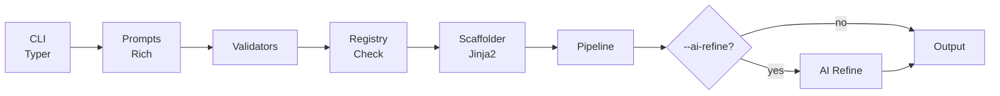
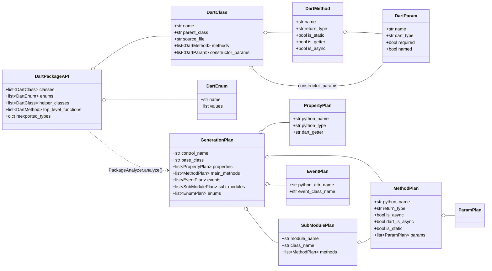
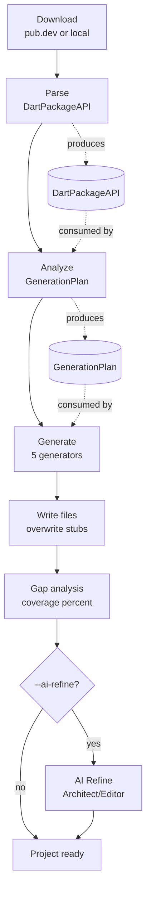
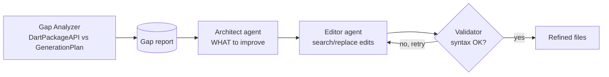

# Architecture

How `flet-pkg` works internally.

## Overview



## Module structure

```
src/flet_pkg/
├── __init__.py              # Version and app name
├── __main__.py              # python -m flet_pkg support
├── main.py                  # Typer app, version callback
├── commands/
│   └── create.py            # Create command logic
├── core/
│   ├── analyzer.py          # PackageAnalyzer → GenerationPlan
│   ├── downloader.py        # PubDevDownloader (pub.dev cache)
│   ├── generators/          # Code generators (Python + Dart)
│   │   ├── base.py          # CodeGenerator abstract base
│   │   ├── python_control.py    # Main control file
│   │   ├── python_submodule.py  # Sub-module files
│   │   ├── python_types.py      # types.py (enums, events)
│   │   ├── python_init.py       # __init__.py exports
│   │   └── dart_service.py      # Dart FletService/FletWidget
│   ├── models.py            # DartPackageAPI, GenerationPlan
│   ├── parser.py            # Dart API parser + detect_extension_type()
│   ├── pipeline.py          # GenerationPipeline orchestrator
│   ├── prompts.py           # Rich interactive prompts
│   ├── registry_checker.py  # PyPI, GitHub, Flet SDK name conflict check
│   ├── scaffolder.py        # Jinja2 template engine
│   ├── type_map.py          # Dart → Python type mapping
│   └── validators.py        # Name validation + derivation
├── core/ai/
│   ├── agent.py             # pydantic-ai Architect/Editor agents
│   ├── config.py            # AIConfig + provider detection
│   ├── gap_analyzer.py      # Deterministic coverage gap analyzer
│   ├── models.py            # GapReport, RefinementResult, etc.
│   ├── provider.py          # Model factory for pydantic-ai
│   └── refiner.py           # AIRefiner orchestrator
├── mcp/
│   ├── server.py            # FastMCP server (tools, resources, prompts)
│   └── _serializers.py      # Dataclass → dict helpers
├── ui/
│   ├── console.py           # Rich console instance
│   ├── coverage.py          # Coverage score + breakdown table
│   ├── panels.py            # Header, info, error panels
│   └── tree.py              # Project tree display
└── templates/
    ├── service/             # Service extension template
    └── ui_control/          # UI Control extension template
```

## Data model

Two aggregates flow through the pipeline: the **parser** produces a
`DartPackageAPI` (a faithful view of the Dart source), and the **analyzer**
transforms it into a `GenerationPlan` (what the generators emit). Both live in
[`core/models.py`](api/models.md).



## Key components

### Typer CLI (`main.py`)

The entry point registers the `create` command and a `--version` callback. Uses `rich_markup_mode="rich"` for styled help text.

### Create command (`commands/create.py`)

Orchestrates the creation flow:

1. Determines extension type (from flag or interactive prompt). If `auto`, downloads the Flutter package and calls `detect_extension_type()` to resolve it.
2. Collects Flutter package name, project name, package name, control class name
3. Calls `derive_names()` to auto-suggest names
4. Checks PyPI, GitHub, and Flet SDK monorepo for name conflicts via `registry_checker`
5. Builds a context dict and passes it to `Scaffolder`
6. Runs the analysis pipeline (download → parse → analyze → generate)
7. Optionally runs AI refinement if `--ai-refine` is set
8. Displays coverage score and the generated project tree

### Registry checker (`core/registry_checker.py`)

Checks for existing packages with the same name before scaffolding:

- **PyPI** — `GET https://pypi.org/pypi/{name}/json` (200 = exists)
- **Flet SDK** — checks `flet-dev/flet` monorepo at `sdk/python/packages/{name}` via GitHub Contents API
- **GitHub** — searches repositories matching the name (top 3 results)

All checks fail silently on network errors to avoid blocking the flow.

### Validators (`core/validators.py`)

- `validate_flutter_package()` — valid pub.dev name
- `validate_project_name()` — lowercase + hyphens
- `validate_package_name()` — valid Python identifier
- `validate_control_name()` — PascalCase
- `derive_names()` — strips Flutter affixes and derives all names from the Flutter package name

### Scaffolder (`core/scaffolder.py`)

Uses Jinja2 to render templates:

1. Walks the template directory tree
2. Resolves `{{variable}}` placeholders in directory and file names
3. Renders `.jinja` files through Jinja2 with the context dict
4. Copies non-Jinja files as-is

### Generation Pipeline (`core/pipeline.py`)

Orchestrates the full code generation flow:

1. **Download** — fetches the Flutter package from pub.dev (or uses a local path)
2. **Parse** — extracts `DartPackageAPI` from Dart source files
3. **Analyze** — produces a `GenerationPlan` (methods, events, enums, properties, sub-modules)
4. **Generate** — runs 5 generators to produce Python + Dart files
5. **Write** — writes generated files to the project directory, overwriting template stubs
6. **Gap analysis** — computes coverage percentage
7. **AI refine** (optional) — runs the Architect/Editor pattern for improvements



### Generators (`core/generators/`)

Five specialized generators produce different parts of the output:

| Generator | Output |
|-----------|--------|
| `PythonControlGenerator` | Main control file (e.g. `onesignal.py`) |
| `PythonSubModuleGenerator` | Sub-module files (e.g. `user.py`, `notifications.py`) |
| `PythonTypesGenerator` | `types.py` with enums and event dataclasses |
| `PythonInitGenerator` | `__init__.py` with exports |
| `DartServiceGenerator` | Dart service/widget files + `extension.dart` |

### AI Refinement (`core/ai/`)

Optional LLM-powered code improvement using the **Architect/Editor** pattern:

1. **Gap Analyzer** (`gap_analyzer.py`) — deterministic comparison of `DartPackageAPI` vs `GenerationPlan` to find coverage gaps
2. **Architect** agent — LLM reasons about WHAT to improve based on the gap report
3. **Editor** agent — LLM produces search/replace edits (HOW to fix)
4. **Validator** — checks syntax of edited files and retries on failure



Supports multiple providers: Ollama (local, free), Anthropic, OpenAI, Google.

### Coverage

The gap analyzer computes a coverage score:

```
coverage = generated_items / total_dart_api_items × 100
```

Categories tracked: Methods, Events, Enums, Properties.

### MCP Server (`mcp/server.py`)

Exposes flet-pkg capabilities to AI agents via the [Model Context Protocol](https://modelcontextprotocol.io/):

- **7 tools**: derive_names, map_dart_type, fetch_metadata, detect_extension_type, scaffold, run_pipeline, analyze_gaps
- **2 resources**: type-map, templates
- **3 prompts**: scaffold_service, scaffold_ui_control, analyze_package

See the [MCP Server documentation](mcp-server.md) for configuration details.

### Templates

Templates live under `src/flet_pkg/templates/`. Each template type has:

- `template.yaml` — template metadata
- A directory tree with `{{variable}}` placeholders in names
- `.jinja` suffix on files that need rendering

Variable substitution happens both in **file/directory names** and in **file contents** (for `.jinja` files).
