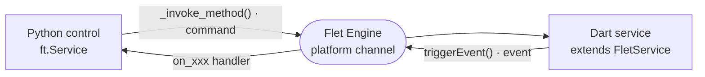

# Service Template

The **Service** template generates a non-visual Flet extension based on `ft.Service`. Use this for wrapping Flutter packages that don't have a UI component — e.g. push notifications, analytics, authentication.

## Generated structure

```
flet-<name>/
├── pyproject.toml
├── README.md
├── CHANGELOG.md
├── LICENSE
├── mkdocs.yml
├── docs/
│   ├── index.md
│   ├── getting-started.md
│   ├── api-reference.md
│   └── examples.md
├── tests/
│   └── test_<package>.py
├── examples/
│   └── <package>_example/
│       ├── pyproject.toml
│       └── src/main.py
└── src/
    ├── <package>/
    │   ├── __init__.py
    │   ├── <control>.py       # @ft.control + ft.Service
    │   └── types.py
    └── flutter/
        └── <package>/
            ├── pubspec.yaml
            ├── analysis_options.yaml
            ├── __init__.py
            └── lib/
                ├── <package>.dart
                └── src/
                    ├── extension.dart
                    └── <control>_service.dart
```

## Python side

The generated Python control uses:

- `@ft.control("ControlName")` decorator to register the control
- `ft.Service` as the base class (non-visual)
- `await self._invoke_method("method_name", {"arg": value})` for Python-to-Dart calls

## Dart side

The generated Flutter code uses:

- `FletExtension.createService()` to register the service
- `control.addInvokeMethodListener()` to handle method calls from Python
- `control.triggerEvent()` to send events back to Python

## Communication

Python and Dart talk through the Flet engine — commands flow one way, events the
other:



## Flet patterns

The Service template follows Flet 0.85.x+ extension patterns:

- **setuptools** build system (required for `package-data` Flutter bundling)
- Python and Dart code live side-by-side under `src/`
- The Flutter package is bundled automatically during `flet build`
