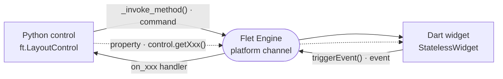

# UI Control Template

The **UI Control** template generates a visual Flet extension based on `ft.LayoutControl`. Use this for wrapping Flutter widgets — e.g. maps, charts, video players, custom UI components.

## Generated structure

```
flet-<name>/
├── pyproject.toml
├── README.md
├── CHANGELOG.md
├── LICENSE
├── mkdocs.yml
├── docs/
│   ├── index.md
│   ├── getting-started.md
│   ├── api-reference.md
│   └── changelog.md
├── tests/
│   └── test_<package>.py
├── examples/
│   └── <package>_example/
│       ├── pyproject.toml
│       └── src/main.py
└── src/
    ├── <package>/
    │   ├── __init__.py
    │   ├── <control>.py       # @ft.control + ft.LayoutControl
    │   └── types.py
    └── flutter/
        └── <package>/
            ├── pubspec.yaml
            ├── analysis_options.yaml
            ├── __init__.py
            └── lib/
                ├── <package>.dart
                └── src/
                    ├── extension.dart
                    └── <control>_control.dart
```

## Python side

The generated Python control uses:

- `@ft.control("ControlName")` decorator to register the control
- `ft.LayoutControl` as the base class (visual widget with layout)
- `await self._invoke_method("method_name", {"arg": value})` for Python-to-Dart calls
- `ft.EventHandler[CustomEvent]` for Dart-to-Python events

## Dart side

The generated Flutter code uses:

- `FletExtension.createWidget()` to register the widget
- `control.addInvokeMethodListener()` to handle method calls from Python
- `control.triggerEvent()` to send events back to Python
- A Flutter `Widget` that renders the actual UI

## Communication

Commands flow Python → Dart, events flow Dart → Python, and properties sync on
`page.update()` — all through the Flet engine:



## Key difference from Service

| | Service | UI Control |
|---|---------|-----------|
| Base class | `ft.Service` | `ft.LayoutControl` |
| Dart factory | `createService()` | `createWidget()` |
| Dart file suffix | `_service.dart` | `_control.dart` |
| Visual | No | Yes |
