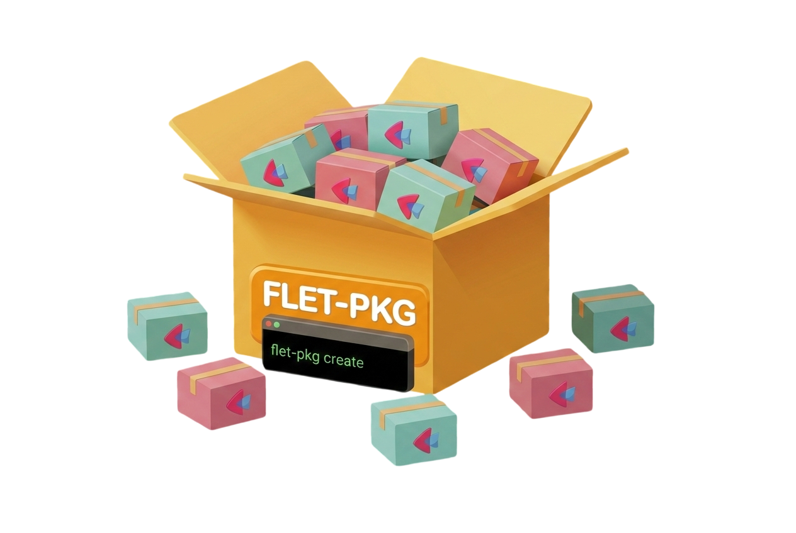

<h1 align="center">flet-pkg</h1>

<p align="center"></p>

**CLI tool to scaffold Flet extension packages.**

Generates complete, ready-to-develop Flet extensions with Python + Flutter/Dart code, following **Flet 0.80.x+** patterns.

!!! warning "Important: this tool does not perform miracles. 🙏😂"

    Every Flutter package on [pub.dev](https://pub.dev) has its own API surface, configuration requirements, and platform-specific behaviors. Some packages expose simple method calls; others require complex initialization flows, native platform setup (Android manifests, iOS plists, Gradle/CocoaPods configuration), or callback-based architectures that don't map cleanly to Python.

    It would be unrealistic to write a code generation algorithm that generalizes perfectly for every possible Flutter package. **flet-pkg** aims to accelerate the process by delivering significantly more than a blank skeleton — it downloads the real Dart source, parses the public API, and auto-generates Python controls, type mappings, enum definitions, event handlers, and Dart bridge code. For service packages, this typically covers ~95% of the API surface.

    However, **the developer is still responsible for**:

    - Understanding how the original Flutter/Dart package works
    - Reviewing the generated code for correctness
    - Handling package-specific configurations (native platform setup, initialization flows, etc.)
    - Adjusting or complementing the generated code for edge cases the pipeline could not cover

    Think of flet-pkg as a smart starting point, not a finished product.

## Features

- **Interactive & non-interactive modes** — guided prompts or full CLI flags
- **Auto-detect extension type** — downloads the Flutter package and detects whether it's a Service or UI Control automatically
- **Three extension types** — Auto-detect (recommended), Service (non-visual), and UI Control (visual widget)
- **Name conflict detection** — checks PyPI, GitHub, and the Flet SDK monorepo before creating, warns if the name already exists
- **Complete project scaffolding** — Python package, Flutter package, tests, docs, examples
- **Smart name derivation** — automatically derives project, package, and class names from the Flutter package name
- **Flet 0.80.x+ patterns** — uses `@ft.control`, `ft.Service`, `ft.LayoutControl`, `invoke_method`, and `EventHandler`
- **AI refinement** — optional LLM-powered code improvement using the Architect/Editor pattern
- **[MCP Server](mcp-server.md)** — expose scaffolding and analysis tools to AI agents via the Model Context Protocol

## Quick install

```bash
pip install flet-pkg
```

Or with [uv](https://docs.astral.sh/uv/):

```bash
uv tool install flet-pkg
```

## Quick start

```bash
flet-pkg create
```

This walks you through creating a new Flet extension with interactive prompts.

For non-interactive usage (auto-detect type):

```bash
flet-pkg create --type auto --flutter-package onesignal_flutter --output .
```

Or specify the type explicitly:

```bash
flet-pkg create --type service --flutter-package onesignal_flutter --output .
```

### With AI refinement

```bash
uv add flet-pkg[ai]
ollama pull qwen2.5-coder:14b
flet-pkg create -f shimmer --ai-refine
```

## Generated project structure

```
flet-onesignal/
├── pyproject.toml
├── README.md
├── CHANGELOG.md
├── LICENSE
├── mkdocs.yml
├── docs/
├── tests/
├── examples/
│   └── flet_onesignal_example/
└── src/
    ├── flet_onesignal/        # Python package
    │   ├── __init__.py
    │   ├── onesignal.py       # @ft.control + ft.Service
    │   └── types.py
    └── flutter/
        └── flet_onesignal/    # Flutter package
            ├── pubspec.yaml
            └── lib/
                └── src/
                    ├── extension.dart
                    └── onesignal_service.dart
```

## Learn more

- [CLI Reference](cli-reference.md) — all flags and options
- [MCP Server](mcp-server.md) — use flet-pkg from AI agents
- [Architecture](architecture.md) — how flet-pkg works internally
- [API Reference](api/index.md) — source code documentation

---

## Support the Project

If you find this project useful, consider giving it a [star on GitHub](https://github.com/brunobrown/flet-pkg) and supporting its development:

<a href="https://www.buymeacoffee.com/brunobrown">

</a>

[:fontawesome-brands-github: GitHub](https://github.com/brunobrown) · [:fontawesome-brands-x-twitter: X](https://x.com/BrunoBrown86) · [:fontawesome-brands-linkedin: LinkedIn](https://linkedin.com/in/bruno-brown-29418167/)

---

## Try **flet-pkg** today and turn any Flutter package into a Flet extension in seconds!

---

<p align="center"></p>
<p align="center"><a href="https://www.bible.com/bible/116/PRO.16.NLT">Commit your work to the LORD, and your plans will succeed. Proverbs 16:3</a></p>
